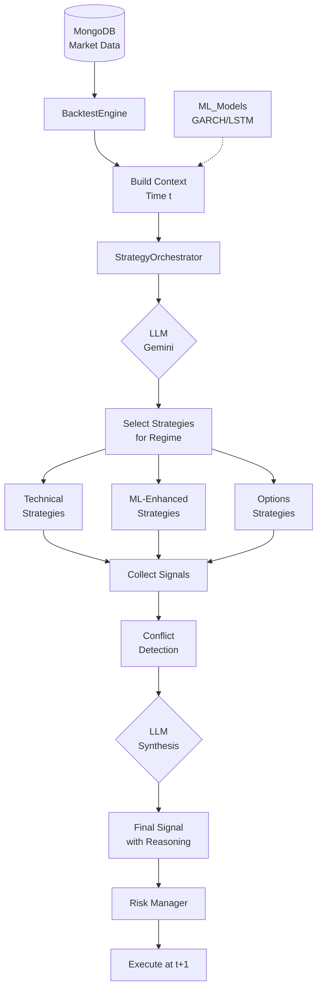
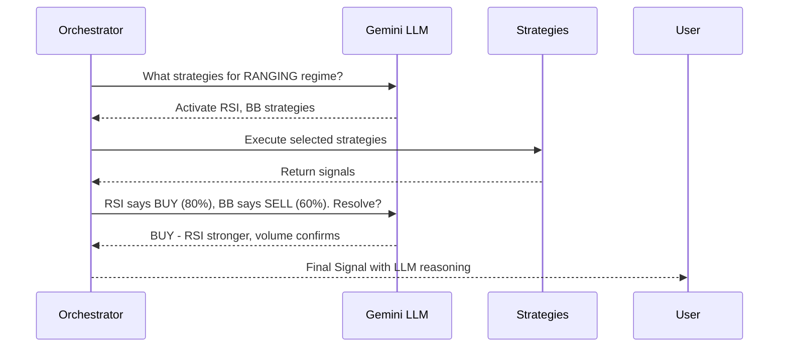

# Quantitative Strategy Library - Strategy Guide

**Version 1.0.0**  
AI-Augmented Trading Platform with Dynamic Orchestration

---

## Table of Contents

1. [Overview](#overview)
2. [Getting Started](#getting-started)
3. [Core Concepts](#core-concepts)
4. [Architecture](#architecture)
5. [Strategy Development](#strategy-development)
6. [Orchestration](#orchestration)
7. [Integration Guide](#integration-guide)
8. [API Reference](#api-reference)
9. [Examples](#examples)

---

## Overview

The **quant_strategy** library provides a production-ready framework for building AI-augmented trading strategies with:

### Key Features

✅ **Dynamic LLM Orchestration** - Gemini-powered strategy selection based on market regime  
✅ **White-Box Explainability** - Every signal includes natural language reasoning  
✅ **Temporal Integrity** - Strict separation of information at time `t` from execution at `t+1`  
✅ **MongoDB Integration** - Efficient data fetching from existing data pipeline  
✅ **Risk Management** - Position limits, drawdown circuit breakers, VaR calculations  
✅ **ML Model Integration** - Seamless connection to existing `ML_Models` (GARCH, LSTM, XGBoost)

---

## Getting Started

### Prerequisites

- Python 3.10+
- MongoDB running locally or remotely
- Gemini API key (for LLM orchestration)
- Data from `Data-inges-fe` pipeline loaded into MongoDB

### Installation

```bash
cd CF-AI-SDE
pip install -r requirements.txt
```

### MongoDB Setup

Ensure your MongoDB has market data:

```javascript
// In MongoDB shell
use trading_db

// Check data exists
db.market_data.findOne({symbol: "AAPL"})

// Should return document with: timestamp, open, high, low, close, volume, RSI, SMA_50, etc.
```

### Environment Configuration

Copy `.env` from `AI_Agents` or set environment variables:

```bash
# Required
export GEMINI_API_KEY="your_gemini_api_key"
export MONGODB_URI="mongodb://localhost:27017/"

# Optional
export GROQ_API_KEY="your_groq_api_key"  # For lightweight LLM tasks
```

### Quick Start

```python
from quant_strategy import BacktestEngine, StrategyOrchestrator, RSIStrategy
from datetime import datetime, timedelta

# Create strategy
rsi = RSIStrategy(oversold=30, overbought=70)

# Create orchestrator
orchestrator = StrategyOrchestrator(strategies=[rsi], use_llm=False)

# Run backtest
engine = BacktestEngine(initial_capital=100000)
results = engine.run(
    start_date=datetime(2023, 1, 1),
    end_date=datetime(2023, 12, 31),
    orchestrator=orchestrator,
    symbol="AAPL"
)

print(f"Total Return: {results['total_return']:.2%}")
print(f"Sharpe Ratio: {results['sharpe_ratio']:.2f}")
```

---

## Core Concepts

### Context

Immutable snapshot of market state at time `t`. Contains ONLY information available at that moment.

```python
@dataclass(frozen=True)
class Context:
    timestamp: datetime          # Current time
    symbol: str                  # Trading symbol
    price: float                 # Current price
    features: Dict[str, float]   # Technical indicators (RSI, SMA, etc.)
    ml_predictions: Dict         # ML model outputs
    portfolio: PortfolioState    # Current holdings
    option_chain: Optional[Dict] # Options data
    current_regime: Regime       # Market regime
```

**Critical**: Context must never contain future information (look-ahead bias prevention).

### Signal

Output from a strategy with full explainability.

```python
@dataclass
class Signal:
    action: Action               # BUY, SELL, HOLD, HEDGE
    confidence: float            # 0.0 to 1.0
    reason: str                  # Natural language explanation (REQUIRED)
    strategy_name: str
    metadata: Dict               # Additional structured data
```

**Every signal must include a `reason`** - this is core to "White Box" transparency.

### Temporal Integrity

The system enforces strict separation between information and execution:

```python
# TIME t: Information available
context_t = build_context(current_bar)

# TIME t: Decision made
signal_t = strategy.generate_signal(context_t)

# TIME t+1: Execution at NEXT bar's open price
execute_trade(signal_t, next_bar['open'])
```

This prevents look-ahead bias - a common source of backtest overfitting.

---

## Architecture



### Data Flow

1. **MongoDB** → Fetches OHLCV + technical indicators
2. **Build Context** → Assembles state at time `t` (includes ML predictions)
3. **Orchestrator** → LLM selects strategies based on regime
4. **Strategy Execution** → Each strategy generates signal
5. **Conflict Resolution** → LLM synthesizes contradictory signals
6. **Risk Gates** → Position limits, drawdown checks
7. **Execution** → Trade at `t+1` open price

---

## Strategy Development

### Creating a Custom Strategy

All strategies inherit from `BaseStrategy`:

```python
from quant_strategy.base import BaseStrategy, Signal, Action, Context, StrategyType

class MyCustomStrategy(BaseStrategy):
    def __init__(self, name="MyStrat", param1=10):
        super().__init__(name, StrategyType.TECHNICAL)
        self.parameters = {'param1': param1}
    
    def generate_signal(self, context: Context) -> Signal:
        # Your logic here
        indicator = context.features.get('RSI', 50)
        
        if indicator < 30:
            return Signal(
                action=Action.BUY,
                confidence=0.8,
                reason=f"Indicator at {indicator:.1f} is oversold",
                strategy_name=self.name
            )
        
        return Signal(
            action=Action.HOLD,
            confidence=0.5,
            reason=f"Indicator at {indicator:.1f} is neutral",
            strategy_name=self.name
        )
    
    # Optional: Dynamic parameter adjustment
    def adjust_parameters(self, volatility: float) -> None:
        super().adjust_parameters(volatility)
        # Adjust self.parameters based on volatility
```

### Built-in Strategies

#### 1. RSIStrategy

Mean reversion based on RSI levels.

```python
from quant_strategy import RSIStrategy

rsi = RSIStrategy(
    name="RSI_MeanRev",
    oversold=30,      # Buy threshold
    overbought=70,    # Sell threshold
    rsi_period=14
)
```

**Signals**:
- BUY when RSI < 30 (oversold)
- SELL when RSI > 70 (overbought)
- HOLD otherwise

#### 2. MovingAverageCrossStrategy

Trend following via MA crossovers.

```python
from quant_strategy import MovingAverageCrossStrategy

ma_cross = MovingAverageCrossStrategy(
    fast_period=50,
    slow_period=200
)
```

**Signals**:
- BUY on Golden Cross (SMA50 > SMA200)
- SELL on Death Cross (SMA50 < SMA200)

#### 3. BollingerBandsStrategy

Mean reversion using Bollinger Bands.

```python
from quant_strategy import BollingerBandsStrategy

bb_strat = BollingerBandsStrategy(
    period=20,
    num_std=2.0
)
```

**Signals**:
- BUY when price < lower band
- SELL when price > upper band

#### 4. MLSignalFilter (Decorator)

Wraps any strategy with ML confidence filtering.

```python
from quant_strategy import RSIStrategy, MLSignalFilter

base = RSIStrategy()
enhanced = MLSignalFilter(
    base_strategy=base,
    confidence_threshold=0.70  # Suppress if ML confidence < 70%
)
```

**Logic**:
- Run base strategy
- Check `context.ml_predictions['direction_confidence']`
- If < threshold: Return HOLD
- If ≥ threshold and agrees: Boost confidence
- If ≥ threshold but conflicts: Reduce confidence

#### 5. VolArbitrageStrategy

Options volatility arbitrage.

```python
from quant_strategy import VolArbitrageStrategy

vol_arb = VolArbitrageStrategy(
    mispricing_threshold=0.10,  # 10% mispricing required
    option_type="call"
)
```

**Logic**:
1. Get predicted volatility from ML (GARCH/LSTM)
2. Calculate Black-Scholes fair value
3. Compare to market price
4. Signal if mispricing > threshold

---

## Orchestration

### Dynamic Strategy Selection

The `StrategyOrchestrator` uses LLM to select strategies based on market regime.

```python
from quant_strategy import StrategyOrchestrator, Regime

# Define regime-to-strategy mapping
regime_map = {
    Regime.BULLISH: ["MA_Trend", "Momentum"],
    Regime.BEARISH: ["Defensive"],
    Regime.RANGING: ["RSI_MeanRev", "BB_MeanRev"],
    Regime.VOLATILE: ["VolArbitrage"],
    Regime.CRISIS: []  # No trading
}

orchestrator = StrategyOrchestrator(
    strategies=[rsi, ma_cross, bb_strat],
    regime_map=regime_map,
    use_llm=True  # Enable Gemini synthesis
)
```

### LLM Synthesis Workflow



### Conflict Resolution

When strategies disagree:

```python
# Example: RSI=Oversold (BUY) but Regime=Bearish (SELL)

orchestrator.decide(context)
# LLM: "RSI oversold suggests short-term bounce, but bearish regime 
#       indicates sell any rallies. HOLD for confirmation."
```

---

## Integration Guide

### Integrating with ML_Models

The library auto-imports from `ML_Models` directory:

```python
# In engine.py, predictions are automatically fetched
from Volatility_Forecasting import Volatility_Models
from Regime_Classificaiton import Regime_Classifier

# These populate context.ml_predictions
context.ml_predictions = {
    'predicted_volatility': 0.018,      # From GARCH/LSTM
    'direction_confidence': 0.85,       # From XGBoost
    'predicted_direction': 'UP'         # From direction_pred
}
```

### Integrating with AI_Agents

The orchestrator can delegate to existing agents:

```python
# Example: Use SignalAggregatorAgent for synthesis
from AI_Agents.agents import SignalAggregatorAgent

# Convert quant_strategy Signals to AgentResponse format
# Then use SignalAggregatorAgent.analyze()
```

### Custom Data Sources

Override `_fetch_data()` in `BacktestEngine`:

```python
class CustomEngine(BacktestEngine):
    def _fetch_data(self, symbol, start, end, batch):
        # Your custom data source (e.g., PostgreSQL, Parquet files)
        return your_data_generator()
```

---

## API Reference

### Core Classes

#### Context
- `timestamp: datetime` - Current time
- `symbol: str` - Trading symbol
- `price: float` - Current price
- `features: Dict` - Technical indicators
- `ml_predictions: Dict` - ML model outputs
- `portfolio: PortfolioState` - Holdings
- `current_regime: Regime` - Market state

#### Signal
- `action: Action` - BUY/SELL/HOLD
- `confidence: float` - 0-1
- `reason: str` - Explanation (required)
- `strategy_name: str`
- `metadata: Dict`

#### BaseStrategy
**Abstract Methods**:
- `generate_signal(context) -> Signal`

**Concrete Methods**:
- `adjust_parameters(volatility)`
- `log_performance(context, signal, outcome)`
- `get_performance_metrics(window)`

### Utilities

#### black_scholes(S, K, T, r, sigma, option_type)
Calculate European option price.

```python
from quant_strategy.utils import black_scholes

fair_value = black_scholes(
    S=100,      # Current price
    K=105,      # Strike
    T=0.25,     # 3 months
    r=0.05,     # 5% risk-free rate
    sigma=0.20  # 20% volatility
)
```

#### kelly_criterion(win_prob, win_loss_ratio, max_allocation)
Optimal position sizing.

```python
from quant_strategy.utils import kelly_criterion

size = kelly_criterion(
    win_probability=0.55,
    win_loss_ratio=1.5,    # Win $1.50 for every $1 lost
    max_allocation=0.25    # Max 25% of capital
)
```

#### Risk Metrics

```python
from quant_strategy.utils import (
    calculate_sharpe_ratio,
    calculate_max_drawdown,
    calculate_sortino_ratio
)

sharpe = calculate_sharpe_ratio(returns, risk_free_rate=0.02)
max_dd = calculate_max_drawdown(equity_curve)
sortino = calculate_sortino_ratio(returns)
```

---

## Examples

### Example 1: Single Strategy Backtest

```python
from quant_strategy import BacktestEngine, StrategyOrchestrator, RSIStrategy
from datetime import datetime

rsi = RSIStrategy(oversold=30, overbought=70)
orchestrator = StrategyOrchestrator(strategies=[rsi], use_llm=False)

engine = BacktestEngine(initial_capital=100000)
results = engine.run(
    start_date=datetime(2023, 1, 1),
    end_date=datetime(2023, 12, 31),
    orchestrator=orchestrator,
    symbol="AAPL"
)

print(f"Sharpe: {results['sharpe_ratio']:.2f}")
engine.export_trades("rsi_trades.csv")
```

### Example 2: ML-Enhanced Strategy

```python
from quant_strategy import RSIStrategy, MLSignalFilter

base = RSIStrategy()
ml_enhanced = MLSignalFilter(base, confidence_threshold=0.75)

orchestrator = StrategyOrchestrator(strategies=[ml_enhanced])
# ... run backtest
```

### Example 3: Full Orchestration

```python
from quant_strategy import *

strategies = [
    RSIStrategy(name="RSI"),
    MovingAverageCrossStrategy(name="MA_Cross"),
    BollingerBandsStrategy(name="BB"),
    VolArbitrageStrategy(name="VolArb")
]

regime_map = {
    Regime.RANGING: ["RSI", "BB"],
    Regime.BULLISH: ["MA_Cross"],
    Regime.VOLATILE: ["VolArb"]
}

orchestrator = StrategyOrchestrator(
    strategies=strategies,
    regime_map=regime_map,
    use_llm=True  # LLM-powered synthesis
)

# Run with full orchestration
results = engine.run(
    start_date=datetime(2023, 1, 1),
    end_date=datetime(2024, 1, 1),
    orchestrator=orchestrator,
    symbol="MSFT"
)
```

---

## Advanced Features

### Dynamic Parameter Adjustment

Strategies auto-adjust to volatility:

```python
# High volatility → wider stops, smaller positions
strategy.adjust_parameters(volatility=0.03)  # 3% volatility
```

### Custom Regime Detection

Override regime detection in engine:

```python
class CustomEngine(BacktestEngine):
    def _detect_regime(self, ml_predictions, features):
        # Your custom logic
        if features['VIX'] > 30:
            return Regime.CRISIS
        # ...
```

### Risk Management Gates

Configure risk limits:

```python
from quant_strategy.components import RiskManager

risk_mgr = RiskManager(
    max_position_size=0.20,        # 20% max per position
    max_sector_concentration=0.40, # 40% max per sector
    max_drawdown=0.15,             # 15% drawdown circuit breaker
    var_limit=0.05                 # 5% VaR limit
)

# Validate before trading
is_valid, reasons = risk_mgr.validate_signal(context, signal)
```

---

## Troubleshooting

### Common Issues

**1. MongoDB Connection Error**

```
pymongo.errors.ServerSelectionTimeoutError: localhost:27017
```

**Solution**: Ensure MongoDB is running:
```bash
# Windows
mongod --dbpath C:\data\db

# Check connection
mongosh --eval "db.runCommand({ping:1})"
```

**2. No Features Found**

```
Signal: RSI indicator not found in features
```

**Solution**: Ensure `Data-inges-fe` has run and populated MongoDB with technical indicators.

**3. LLM API Error**

```
Failed to initialize LLM: Invalid API key
```

**Solution**: Set your Gemini API key:
```bash
export GEMINI_API_KEY="your_actual_key"
```

---

## Performance Optimization

### Reduce LLM API Calls

```python
# Enable caching
orchestrator = StrategyOrchestrator(
    strategies=strategies,
    use_llm=True
)
# Orchestrator automatically caches decisions per regime
```

### Batch Size Tuning

```python
# Larger batches = fewer MongoDB queries but more memory
engine.run(..., batch_size=5000)  # Default: 1000
```

---

## Roadmap

Planned features:
- [ ] Live trading integration
- [ ] Portfolio optimization (Markowitz, Black-Litterman)
- [ ] Multi-asset backtesting
- [ ] Walk-forward optimization
- [ ] Genetic algorithm for parameter tuning

---

## License

This library is part of the CF-AI-SDE project for educational purposes.

## Support

For issues or questions:
1. Check troubleshooting section
2. Review example_usage.py
3. Examine MongoDB schema: `db.market_data.findOne()`

---

**Built with**: Python 3.10, MongoDB, LangChain, Gemini AI, Scipy
